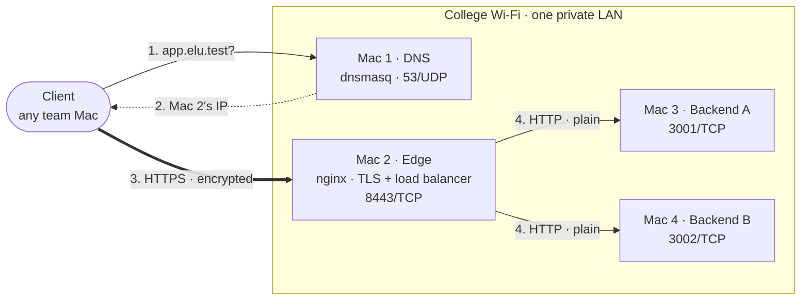

<div align="center">

# Private Network Service Platform

**Computer Networks Course Project · Phase 1: Build & Observe · Team elu**

A client opens `https://app.elu.test:8443`. Our own DNS server resolves the name, our own nginx edge terminates TLS,<br/>
and our own load balancer forwards the request to one of two backends: four MacBooks on one Wi-Fi network, no cloud.

macOS · dnsmasq · nginx · OpenSSL · Python 3 · Wireshark

[Architecture](docs/01-architecture.md) · [Setup Flow](docs/02-setup-flow.md) · [Configuration](#configuration) · [Failure Demonstrations](docs/09-failure-demos.md) · [Evidence](evidence/)

</div>

> [!NOTE]
> The application is deliberately simple; the network is the project. Every layer of one request (DNS, TCP, TLS, HTTP, caching, load balancing) is configured by us and verified with `dig`, `curl` and Wireshark.

## Team

| Machine | Member | Role | Runs |
| :-- | :-- | :-- | :-- |
| **Mac 1** | Srijan Patel | Private DNS server + client | dnsmasq |
| **Mac 2** | Abhayanth K | Edge: reverse proxy, load balancer, TLS termination + client | nginx, team CA |
| **Mac 3** | Aryan Patel | Backend A + client + packet capture | `server.py A 3001`, Wireshark |
| **Mac 4** | Ashrith | Backend B + client | `server.py B 3002` |

All four machines are connected over a single college Wi-Fi LAN with static private IPs. Every team member also acts as a client, testing the full request path end-to-end from their own machine.

## Architecture



| Machine | Role | Listens on | Cloud equivalent |
| :-- | :-- | :-- | :-- |
| Mac 1 | Private DNS | 53/UDP | Amazon Route 53 |
| Mac 2 | Edge: TLS + load balancer | 8443/TCP (8080 → 301 redirect) | AWS Application Load Balancer / CDN edge |
| Mac 3 | Backend A | 3001/TCP | Application instance A |
| Mac 4 | Backend B | 3002/TCP | Application instance B |

Topology, IP inventory and the layer-by-layer request flow: [docs/01-architecture.md](docs/01-architecture.md)

## Running the Backends

The backend is a single file, [`backend/server.py`](backend/server.py), using only the Python 3 standard library. No packages are required.

```bash
# Mac 3: Backend A
python3 backend/server.py A 3001

# Mac 4: Backend B (same file, different ID and port)
python3 backend/server.py B 3002
```

Each prints `Backend A listening on 0.0.0.0:3001` (or B / 3002) and logs every request. Stop with <kbd>Ctrl</kbd>+<kbd>C</kbd>. If macOS asks whether Python may accept incoming connections, choose **Allow**.

<details>
<summary><b>Verify</b></summary>

```bash
curl -i http://127.0.0.1:3001/api/status        # on Mac 3 → 200, X-Backend: A
curl -i http://127.0.0.1:3002/api/status        # on Mac 4 → 200, X-Backend: B
lsof -nP -iTCP:3001 -sTCP:LISTEN                # must show *:3001, not 127.0.0.1:3001
```

| Endpoint | Returns |
| :-- | :-- |
| `GET /` | `{"message": "Backend A is running", …}` |
| `GET /api/status` | `{"backend": "A", "status": "ok", …}` · `Cache-Control: no-store` |
| `GET /api/info` | fixed JSON · `Cache-Control: public, max-age=60` · `ETag` (`304` on match) |
| every response | `X-Backend: A` or `B` |

</details>

> [!IMPORTANT]
> The backends bind to `0.0.0.0` so nginx on Mac 2 can reach them over Wi-Fi. Clients never call them directly; every request goes through `https://app.elu.test:8443`.

<details>
<summary><b>Building the whole platform (all four Macs)</b></summary>

| Order | Mac | Step | Reference |
| :-: | :-: | :-- | :-- |
| 1 | all | Same Wi-Fi, record IPs, create the shared settings file | [02 · Setup flow](docs/02-setup-flow.md) |
| 2 | 1 | dnsmasq with our zone; clients point their DNS at Mac 1 | [03 · DNS](docs/03-dns.md) |
| 3 | 3, 4 | Start Backend A and Backend B | [04 · Backends](docs/04-backends.md) |
| 4 | 2 | nginx upstream over HTTP, then HTTPS | [05 · Load balancer](docs/05-load-balancer.md) |
| 5 | 2 → all | Team CA, server certificate, trust on every Mac | [06 · TLS](docs/06-tls.md) |
| 6 | 3 | Wireshark capture of one request | [08 · Packet capture](docs/08-packet-capture.md) |

Start order: backends → nginx → dnsmasq → clients point DNS at Mac 1. Stop in reverse.

</details>

## Configuration

| Layer | Machine | Key idea | Configuration | Documentation |
| :-- | :-: | :-- | :-- | :-- |
| **DNS** | Mac 1 | `local=/elu.test/` + `host-record` answer our names; everything else is forwarded | [`dnsmasq.conf.template`](config/dnsmasq.conf.template) | [03 · DNS](docs/03-dns.md) |
| **Backends** | Mac 3, 4 | Same code, different `X-Backend` ID; bound to `0.0.0.0` | [`server.py`](backend/server.py) | [04 · Backends](docs/04-backends.md) |
| **Load balancing** | Mac 2 | `upstream` pool, round robin, `proxy_next_upstream` failover | [`team-https.conf.template`](config/nginx/team-https.conf.template) | [05 · Load balancer](docs/05-load-balancer.md) |
| **HTTPS / TLS** | Mac 2 | Team CA signs `app.elu.test`; TLS terminates at nginx | [`team-https.conf.template`](config/nginx/team-https.conf.template) | [06 · TLS](docs/06-tls.md) |
| **Caching** | Mac 3, 4 | `max-age=60` + identical ETag → `304` from either backend | [`server.py`](backend/server.py) | [07 · Caching](docs/07-caching.md) |
| **Packet evidence** | Mac 3 | DNS → TCP → TLS → HTTP in one capture | — | [08 · Packet capture](docs/08-packet-capture.md) |

All configuration files are generated from one shared settings file, so every Mac uses the same IPs: see [`config/`](config/).

## Failure Demonstrations

| # | Fault | Observation | Failed layer |
| :-: | :-- | :-- | :-- |
| F1 | Client uses the wrong DNS server | Name lookup fails, ping to Mac 2 still works | DNS |
| F2 | DNS record points to the wrong IP | Name resolves, connection fails | DNS answer → TCP |
| F3 | One backend stopped | All requests `200`, all served by B | none: the edge fails over |
| F4 | Both backends stopped | DNS, TCP and TLS succeed; nginx returns `502` | upstream of the edge |
| F5 | Wrong destination port | Host reachable, port refused | Transport |

Commands, observed output and explanations: [docs/09-failure-demos.md](docs/09-failure-demos.md)

## Repository Layout

<details>
<summary><b>Show tree</b></summary>

```text
.
├── README.md
├── backend/
│   └── server.py                     Backend A / B (Python 3 standard library)
├── config/
│   ├── README.md                     templates and where they are installed
│   ├── cn-team.env.example           shared settings: team name + 4 IPs
│   ├── dnsmasq.conf.template         Mac 1
│   ├── nginx/
│   │   ├── team-http.conf.template   Mac 2, stage 1 (HTTP :8080)
│   │   └── team-https.conf.template  Mac 2, final (HTTPS :8443)
│   └── live/                         configuration files that actually ran
├── docs/
│   ├── 01-architecture.md            topology, inventory, request flow
│   ├── 02-setup-flow.md              build order and coordination
│   ├── 03-dns.md … 07-caching.md     one document per layer
│   ├── 08-packet-capture.md          Wireshark analysis
│   └── 09-failure-demos.md           F1–F5
└── evidence/                         screenshots + .pcapng, one folder per task
```

</details>

## Phase 1 Gate

- [x] A client resolves `app.elu.test` through our DNS server (Mac 1)
- [x] It connects over HTTPS with no certificate warning and without `-k`
- [x] It receives responses from both backends through the load balancer
- [x] Packet evidence of DNS → TCP → TLS → HTTP

<div align="center">
<sub>Computer Networks · Rishihood University</sub>
</div>
