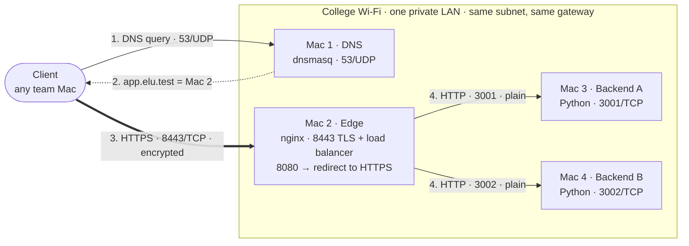
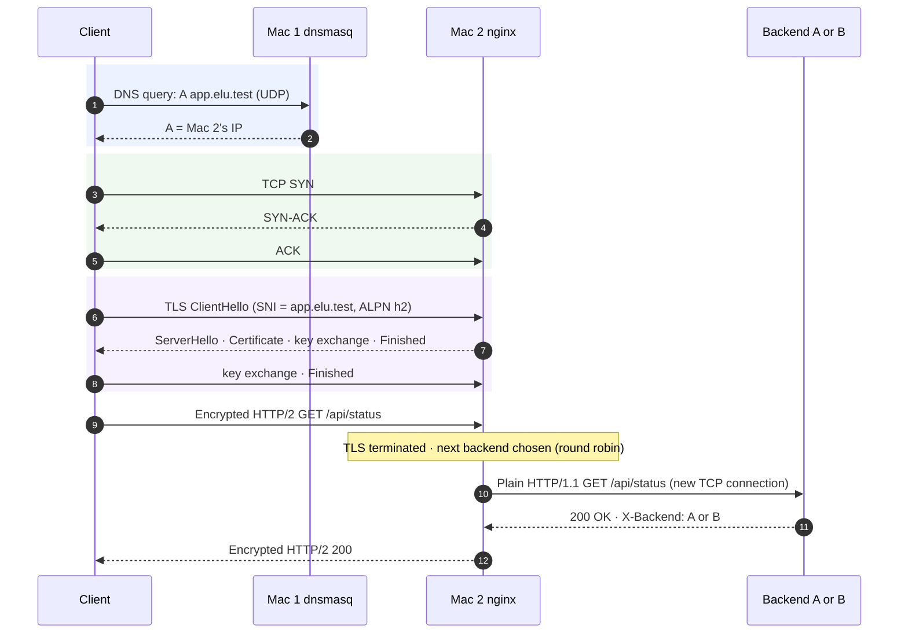

<div align="center">

# 01 · Architecture

**Four MacBooks, four network roles, one private LAN.**

[← README](../README.md) · **Architecture** · [Setup flow →](02-setup-flow.md)

</div>

> [!NOTE]
> **Summary:** Mac 1 resolves names (DNS), Mac 2 is the single entry point that terminates TLS and balances load (nginx), and Mac 3 and Mac 4 run two identical backend instances. A client only ever communicates with the DNS server and the edge.

## Topology



## Roles and Services

| Machine | Role | Software | Listens on | Cloud equivalent |
| :-- | :-- | :-- | :-- | :-- |
| **Mac 1** | Private DNS server + client | dnsmasq | `127.0.0.1:53`, `<Mac 1 IP>:53` (UDP) | Amazon Route 53 (private hosted zone) |
| **Mac 2** | Edge: reverse proxy, load balancer, TLS termination + client | nginx ≥ 1.25.1 | `*:8080` (redirect), `*:8443` (HTTPS) | AWS Application Load Balancer / CDN edge |
| **Mac 3** | Backend A + client + packet capture | Python 3 `server.py`, Wireshark | `0.0.0.0:3001` | Application instance A in a target group |
| **Mac 4** | Backend B + client | Python 3 `server.py` | `0.0.0.0:3002` | Application instance B in a target group |

> [!IMPORTANT]
> **The client never learns a backend address.** DNS only returns Mac 2's IP, and only nginx holds the backend list. This single, stable entry point is what a cloud load balancer provides: backends can be added, moved or fail without any client noticing.

## IP Inventory (Task A)

All four Macs share one subnet mask and one gateway, which shows they are on the same LAN segment.

| Mac | Role | Hostname | IPv4 | Mask / prefix | Gateway | Interface | MAC address |
| :-- | :-- | :-- | :-- | :-- | :-- | :-- | :-- |
| Mac 1 | DNS + client | Apples-MacBook-Pro | 10.7.21.66 | 255.255.224.0 (/19) | 10.7.0.1 | en0 | 6a:da:87:fb:7c:3c |
| Mac 2 | Edge / LB / TLS + client | abhayanths-MacBook-Pro | 10.7.11.181 | 255.255.224.0 (/19) | 10.7.0.1 | en0 | d2:ab:99:21:7b:8a |
| Mac 3 | Backend A + client + capture | Aryans-MacBook-Pro-9 | 10.7.15.50 | 255.255.224.0 (/19) | 10.7.0.1 | en0 | 36:9f:78:53:17:8d |
| Mac 4 | Backend B + client | `TODO` | `TODO` | 255.255.224.0 (/19) | 10.7.0.1 | en0 | `TODO` |

<details>
<summary><b>How each column was collected</b></summary>

```bash
ipconfig getifaddr en0                       # IPv4
networksetup -getinfo Wi-Fi                  # IPv4, subnet mask, router (gateway)
ifconfig en0 | grep -E "inet |ether"         # netmask in hex + MAC address
hostname
```

`/19` = `255.255.224.0`: the first 19 bits identify the network, leaving 13 bits (8,190 usable host addresses) for devices.

</details>

## DNS Records

| Name | Type | Value | Answered by |
| :-- | :-- | :-- | :-- |
| `app.elu.test` | A (+ PTR) | Mac 2 | Mac 1, locally |
| `api.elu.test` | A (+ PTR) | Mac 2 | Mac 1, locally |
| any other `*.elu.test` | — | `NXDOMAIN` | Mac 1, locally (never forwarded) |
| all other names (`google.com` …) | — | forwarded | College DNS / `1.1.1.1` |

## Request Flow Across the Layers

Sequence of events for `https://app.elu.test:8443/api/status`:



| Step | Protocol | TCP/IP layer | OSI layer | Ports |
| :-- | :-- | :-- | :-- | :-- |
| Name resolution | DNS | Application | 7 | client ephemeral → **53/UDP** |
| Connection setup | TCP | Transport | 4 | client ephemeral → **8443/TCP** |
| Encryption + server identity | TLS 1.3 / 1.2 | between Application and Transport | 5–6 | inside 8443/TCP |
| Request / response | HTTP/2 (client ↔ edge), HTTP/1.1 (edge ↔ backend) | Application | 7 | 8443 encrypted · 3001/3002 plain |
| Addressing | IPv4 | Internet | 3 | — |
| Wi-Fi frames | 802.11 | Link | 1–2 | MAC addresses |

> [!NOTE]
> **DNS resolution is separate from the connection.** DNS only answers "which IP has this name?". The TCP handshake and the TLS handshake happen afterwards, directly with that IP.

## Design Decisions

<details>
<summary><b>Decisions and reasons</b></summary>

| Decision | Reason |
| :-- | :-- |
| Domain under `.test` | Reserved for testing. `.local` is handled by macOS mDNS/Bonjour and would never reach our DNS server |
| Ports 8080/8443 instead of 80/443 | Permitted by the brief; nginx runs as a normal user without `sudo` |
| A team CA instead of a single self-signed certificate | Mirrors real PKI: clients trust one CA, and the CA vouches for the server certificate |
| TLS terminated at nginx | Keys and certificates live in one place; backends stay simple |
| Round robin + `max_fails=1 fail_timeout=10s` + `proxy_next_upstream` | Even distribution; a failed backend is skipped and the request retried on the other, so clients see no error |
| `/api/info` byte-identical on both backends | Same ETag everywhere, so a conditional request returns `304` regardless of which backend answers |
| dnsmasq forwards non-project names upstream | Clients keep normal internet access while using Mac 1 as their only DNS server |

</details>

## Known Limitations (Phase 2 scope)

| Limitation | Impact | Phase 2 extension |
| :-- | :-- | :-- |
| Backend ports reachable directly from the LAN | nginx can be bypassed over plain HTTP | Ext C: restrict 3001/3002 to Mac 2 only |
| Single DNS server | A DNS outage stops name resolution for every client | Ext A: backup resolver on a second Mac |
| Single nginx edge | Single point of failure for the whole service | Ext E: standby edge + DNS cutover |

---

<div align="center">

[← README](../README.md) · [Setup flow →](02-setup-flow.md)

</div>
