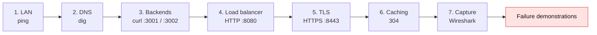
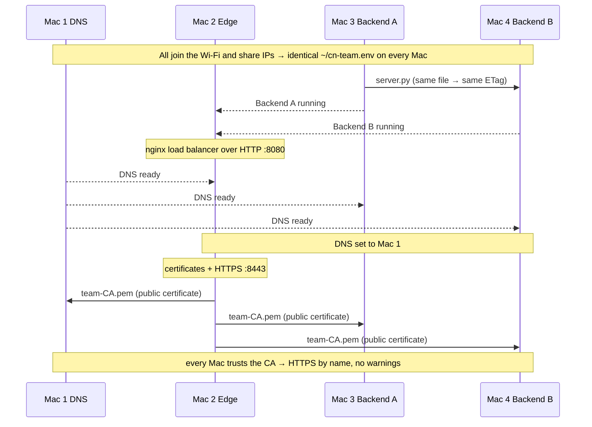
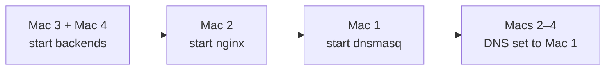

<div align="center">

# 02 · Setup Flow

**The platform was built one layer at a time, each verified before the next.**

[← Architecture](01-architecture.md) · **Setup flow** · [DNS →](03-dns.md)

</div>

> [!NOTE]
> **Summary:** layers were added in order (LAN → DNS → backends → load balancer → TLS → caching → capture), and each one was verified with a network tool before the next was added. A failure could therefore always be traced to a single layer.

## Build Order



| # | Layer | Mac | Work done | Verification | Expected |
| :-: | :-- | :-: | :-- | :-- | :-- |
| 1 | LAN | all | Joined one Wi-Fi network; recorded IP, mask, gateway and MAC address | `ping -c 4 <each Mac>` | replies from all four |
| 2 | DNS | 1 | dnsmasq answers `*.elu.test` and forwards other names | `dig app.elu.test` | Mac 2's IP, `SERVER` = Mac 1 |
| 3 | Backends | 3, 4 | Same `server.py`, run as A on 3001 and B on 3002 | `curl -i http://<Mac 3 IP>:3001/api/status` | `X-Backend: A` (and `B` on Mac 4) |
| 4 | Load balancer | 2 | nginx `upstream` over plain HTTP on 8080 | 4 × `curl` through Mac 2 | A, B, A, B |
| 5 | TLS | 2 → all | Team CA signs `app.elu.test`; every Mac trusts the CA | `/usr/bin/curl -v https://app.elu.test:8443/api/status` | TLS 1.3, issuer = team CA, no `-k` |
| 6 | Caching | 3, 4 | `/api/info` returns `max-age=60` + `ETag` | `curl -I -H "If-None-Match: …"` | `304 Not Modified` |
| 7 | Capture | 3 | Wireshark on Wi-Fi during one request | `.pcapng` file | DNS → TCP → TLS → HTTP |

> [!WARNING]
> Adding DNS, TLS and load balancing at the same time makes any failure ambiguous: there is no way to tell which layer broke. Building layer by layer avoids this.

## Coordination Between Machines

Each machine was configured by its owner; these were the dependencies between them.



## Shared Settings File

Every Mac keeps an identical `~/cn-team.env`. All configuration files and commands read their values from it, so an IP change is a one-line edit. Template: [`config/cn-team.env.example`](../config/cn-team.env.example).

```bash
export TEAM=elu                    # names: app.elu.test, api.elu.test
export MAC1_IP=…                   # Mac 1: DNS
export MAC2_IP=…                   # Mac 2: edge
export MAC3_IP=…                   # Mac 3: Backend A
export MAC4_IP=…                   # Mac 4: Backend B
export COLLEGE_DNS=8.8.8.8         # upstream for every non-project name
```

## Key Commands per Machine

<details>
<summary><b>Mac 1: DNS</b></summary>

```bash
brew install dnsmasq
# write $(brew --prefix)/etc/dnsmasq.conf from config/dnsmasq.conf.template (see 03 · DNS)
dnsmasq --test                                        # dnsmasq: syntax check OK.
sudo brew services start dnsmasq                      # port 53 requires root
sudo networksetup -setdnsservers Wi-Fi 127.0.0.1      # Mac 1 uses itself
```

Details: [03 · DNS](03-dns.md)

</details>

<details>
<summary><b>Mac 2: Edge</b></summary>

```bash
brew install nginx
# create the team CA and server certificate (see 06 · TLS)
# write $(brew --prefix)/etc/nginx/servers/team-https.conf from config/nginx/ (see 05 · Load balancer)
nginx -t && brew services start nginx                 # no sudo: ports 8080/8443
sudo networksetup -setdnsservers Wi-Fi <Mac 1 IP>
```

Details: [05 · Load balancer](05-load-balancer.md) · [06 · TLS](06-tls.md)

</details>

<details>
<summary><b>Mac 3 and Mac 4: Backends</b></summary>

```bash
python3 backend/server.py A 3001                      # Mac 3
python3 backend/server.py B 3002                      # Mac 4
sudo networksetup -setdnsservers Wi-Fi <Mac 1 IP>     # both
```

Details: [04 · Backends](04-backends.md)

</details>

<details>
<summary><b>Every Mac: trust the team CA</b></summary>

```bash
sudo security add-trusted-cert -d -r trustRoot \
  -k /Library/Keychains/System.keychain team-CA.pem
```

`-d` admin trust settings (all users) · `-r trustRoot` trusted as a root CA · `-k` the System keychain, read by browsers and `/usr/bin/curl`.

</details>

## Start and Stop Order



Shutdown runs in reverse: clients reset their DNS to automatic first, and Mac 1 stops dnsmasq last. A client still pointing at a stopped DNS server cannot resolve any name.

---

<div align="center">

[← Architecture](01-architecture.md) · [DNS →](03-dns.md)

</div>
