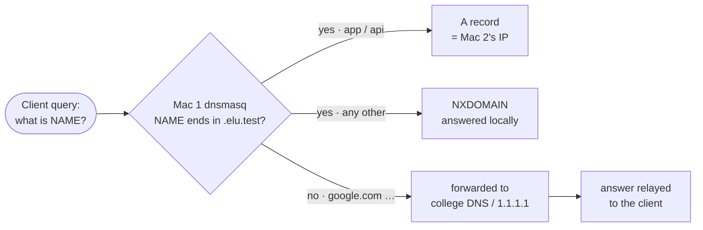

<div align="center">

# 03 · Private DNS (Mac 1)

**dnsmasq answers the project names itself and forwards all other names.**

[← Setup flow](02-setup-flow.md) · **DNS** · [Backends →](04-backends.md)

</div>

> [!NOTE]
> **Summary:** every Mac sends its DNS queries to Mac 1. dnsmasq answers `app.elu.test` and `api.elu.test` with Mac 2's IP, returns `NXDOMAIN` for any other `*.elu.test` name, and forwards ordinary names (`google.com`) to the college DNS server so internet access keeps working.

## Resolution Logic



## Configuration

File on Mac 1: `$(brew --prefix)/etc/dnsmasq.conf` · Template: [`config/dnsmasq.conf.template`](../config/dnsmasq.conf.template)

```ini
listen-address=127.0.0.1,<Mac 1 IP>      # Mac 1 itself + the other Macs over Wi-Fi
bind-interfaces

no-resolv                                 # ignore the Mac's own DNS settings
server=<college DNS>                      # upstream for every non-project name
server=1.1.1.1

local=/elu.test/                          # authoritative for this zone: never forwarded
host-record=app.elu.test,<Mac 2 IP>
host-record=api.elu.test,<Mac 2 IP>

domain-needed
bogus-priv
log-queries
```

<details>
<summary><b>Directive reference</b></summary>

| Directive | Purpose |
| :-- | :-- |
| `listen-address=127.0.0.1,<Mac 1 IP>` | Serve Mac 1 itself (loopback) and the other Macs (Wi-Fi address) |
| `bind-interfaces` | Bind only to those two addresses |
| `no-resolv` | Do not read `/etc/resolv.conf`; once Mac 1 uses itself as its resolver, reading it would create a loop |
| `server=` | Upstream servers for all other names. Without them, external names stop resolving on all four Macs |
| `local=/elu.test/` | Authoritative for the zone: unknown names such as `xyz.elu.test` receive `NXDOMAIN` immediately and are never sent upstream |
| `host-record=` | Creates the A record (name → IP) and the matching PTR record (IP → name) |
| `domain-needed` | Never forward single-label names (e.g. `printer`) upstream |
| `bogus-priv` | Never forward reverse lookups for private address ranges upstream |
| `log-queries` | Log every query, providing evidence that clients use Mac 1 |

</details>

## Client Configuration

```bash
sudo networksetup -setdnsservers Wi-Fi <Mac 1 IP>    # Macs 2, 3, 4   (Mac 1 uses 127.0.0.1)
sudo dscacheutil -flushcache; sudo killall -HUP mDNSResponder
```

| Command | Effect |
| :-- | :-- |
| `networksetup -setdnsservers Wi-Fi …` | Replaces the DHCP-provided DNS server with Mac 1 |
| `dscacheutil -flushcache` | Clears macOS's cache of earlier lookups |
| `killall -HUP mDNSResponder` | Makes the macOS resolver process drop its cache and reload its settings |

## Verification

```bash
dig app.elu.test | grep -E "^app|SERVER"
dig +short api.elu.test
dig nothere.elu.test | grep status
```

<details>
<summary><b>Output</b></summary>

```text
app.elu.test.		0	IN	A	<Mac 2 IP>
;; SERVER: <Mac 1 IP>#53(<Mac 1 IP>)
<Mac 2 IP>
;; ->>HEADER<<- opcode: QUERY, status: NXDOMAIN, id: …
```

| Line | Shows |
| :-- | :-- |
| A record → Mac 2's IP | Our record is served |
| `SERVER: <Mac 1 IP>#53` | The answer came from our DNS server, on port 53 |
| `NXDOMAIN` for `nothere.elu.test` | The zone is answered locally; unknown names are not forwarded |

</details>

Live query log on Mac 1 while other Macs run `dig`:

```bash
log stream --predicate 'process == "dnsmasq"' --info
```

## Common Problems

| Symptom | Cause | Fix |
| :-- | :-- | :-- |
| `dig` works, but the browser cannot find the server | VPN, iCloud Private Relay or "Limit IP address tracking" bypass our DNS | Disable them |
| A `.local` name never resolves | `.local` is reserved for macOS mDNS/Bonjour | Use `.test` |
| An old answer persists after a change | macOS cached the previous reply | Flush the cache (commands above) |
| No website loads on another network | DNS still points at Mac 1 | `sudo networksetup -setdnsservers Wi-Fi empty` |

---

<div align="center">

[← Setup flow](02-setup-flow.md) · [Backends →](04-backends.md)

</div>
