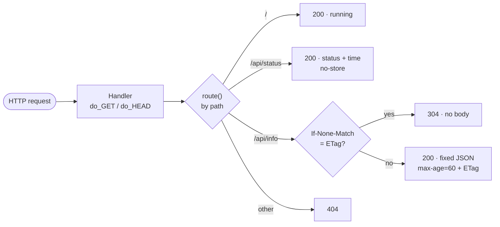

<div align="center">

# 04 · Backends (Mac 3 and Mac 4)

**One Python file, run as two instances: Backend A and Backend B.**

[← DNS](03-dns.md) · **Backends** · [Load balancer →](05-load-balancer.md)

</div>

> [!NOTE]
> **Summary:** [`backend/server.py`](../backend/server.py) is a dependency-free REST server. Mac 3 runs it as Backend A on port 3001 and Mac 4 runs the same file as Backend B on port 3002. Every response carries an `X-Backend` header identifying the instance that served it.

## Running

| Mac | Command | Output |
| :-- | :-- | :-- |
| Mac 3 | `python3 backend/server.py A 3001` | `Backend A listening on 0.0.0.0:3001` |
| Mac 4 | `python3 backend/server.py B 3002` | `Backend B listening on 0.0.0.0:3002` |

Only the Python 3 standard library is used. Stop with <kbd>Ctrl</kbd>+<kbd>C</kbd>. When macOS asks whether Python may accept incoming connections, choose **Allow**.

> [!CAUTION]
> **The server binds to `0.0.0.0`, not `127.0.0.1`.** `127.0.0.1` accepts connections from the same machine only, so nginx on Mac 2 would receive *connection refused*. `0.0.0.0` listens on every interface, including Wi-Fi. Check with `lsof -nP -iTCP:3001 -sTCP:LISTEN`, which must show `*:3001`.

## Endpoints

| Request | Status | Key headers | Body | Purpose |
| :-- | :-: | :-- | :-- | :-- |
| `GET /` | 200 | `X-Backend` | `{"message": "Backend A is running", "host": …}` | Required by the brief |
| `GET /api/status` | 200 | `X-Backend`, `Cache-Control: no-store` | `{"backend": "A", "status": "ok", "time": …}` | Required; dynamic, never cached |
| `GET /api/info` | 200 | `X-Backend`, `Cache-Control: public, max-age=60`, `ETag` | fixed JSON, identical on A and B | Caching demonstration |
| `GET /api/info` + matching `If-None-Match` | 304 | same, no body | — | Conditional request |
| any other path | 404 | `X-Backend` | `{"error": "not found"}` | |

`HEAD` is supported on every path, so `curl -I` receives the same headers without a body.

## Request Handling



<details>
<summary><b>Code walkthrough</b></summary>

| Part | Function |
| :-- | :-- |
| `sys.argv[1]`, `sys.argv[2]` | The arguments after `python3 server.py`: `A 3001` → ID `A`, port 3001. The same file with different arguments gives a different backend |
| `INFO_BODY` | The fixed JSON for `/api/info`, as bytes |
| `INFO_ETAG` | The first 16 hex characters of the SHA-1 hash of `INFO_BODY`: a fingerprint of the content. Identical bytes on both Macs give an identical ETag |
| `class Handler(BaseHTTPRequestHandler)` | Python's built-in HTTP server parses each request and calls `do_GET` or `do_HEAD` |
| `route()` | Selects the response from `self.path` |
| `If-None-Match` check | If the client's cached ETag matches, the server answers `304 Not Modified` with no body |
| `reply()` | Writes the status line, headers (`X-Backend`, `Content-Type`, `Content-Length`, extras), a blank line, then the body |
| `ThreadingHTTPServer(("0.0.0.0", PORT), Handler)` | Opens a listening TCP socket on every interface; each request is handled in its own thread |
| `serve_forever()` | Accepts and handles connections until interrupted |

</details>

> [!IMPORTANT]
> Mac 4 received `server.py` as a copy of Mac 3's file rather than a retyped version. The caching behaviour depends on both backends producing the **same ETag**; with different ETags, a conditional request handled by the other backend would return a full `200` instead of `304`.

## Verification

On each backend Mac:

```bash
curl -i http://127.0.0.1:3001/api/status          # Mac 3 → X-Backend: A
curl -i http://127.0.0.1:3002/api/status          # Mac 4 → X-Backend: B
```

From Mac 2 across the LAN, bypassing nginx:

```bash
curl -s -D - -o /dev/null http://<Mac 3 IP>:3001/api/status | grep -i x-backend
curl -s -D - -o /dev/null http://<Mac 4 IP>:3002/api/status | grep -i x-backend
curl -sI http://<Mac 3 IP>:3001/api/info | grep -i etag
curl -sI http://<Mac 4 IP>:3002/api/info | grep -i etag
```

<details>
<summary><b>Output</b></summary>

```text
X-Backend: A
X-Backend: B
ETag: "6402143662621d1b"
ETag: "6402143662621d1b"
```

Both backends respond across the LAN, and both return the same ETag for `/api/info`.

</details>

---

<div align="center">

[← DNS](03-dns.md) · [Load balancer →](05-load-balancer.md)

</div>
