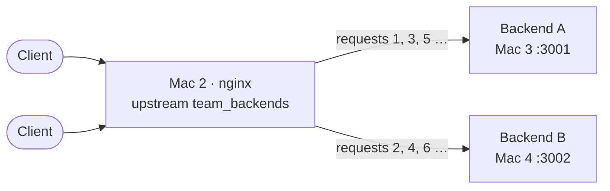
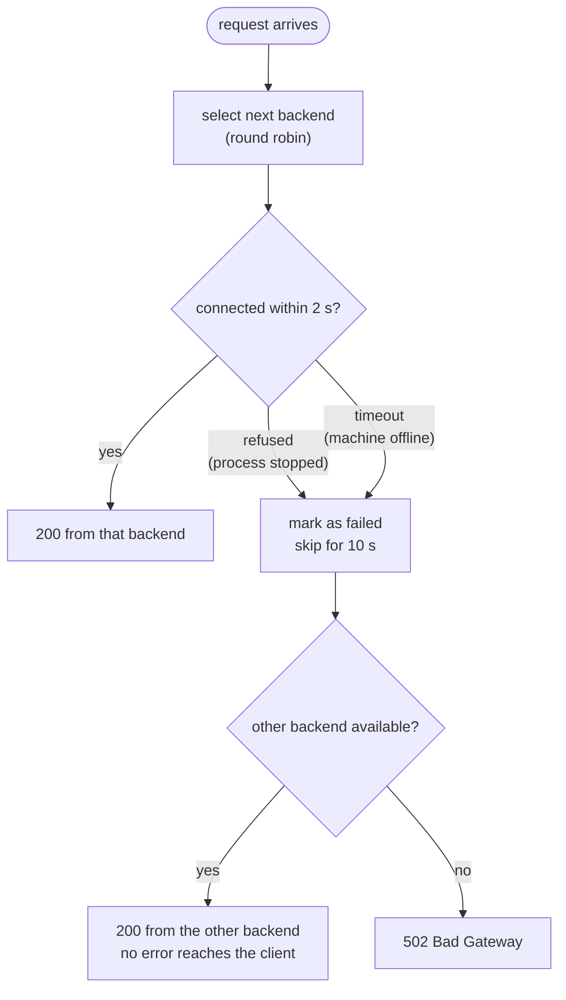

<div align="center">

# 05 · Reverse Proxy & Load Balancer (Mac 2)

**nginx is the single entry point; clients never see a backend.**

[← Backends](04-backends.md) · **Load balancer** · [TLS →](06-tls.md)

</div>

> [!NOTE]
> **Summary:** nginx on Mac 2 receives every request and forwards it to Backend A or Backend B in turn (round robin). If one backend is unavailable, nginx retries the request on the other, so the client does not see the failure.

## Concept



| Term | Meaning in this project |
| :-- | :-- |
| **Reverse proxy** | nginx accepts the client's connection and opens its own connection to a backend. The client only communicates with nginx |
| **Load balancer** | Distributes requests across the `upstream` pool |
| **Round robin** | Backends take turns: A, B, A, B. nginx's default policy |
| **Upstream** | The backend pool, known only to nginx |

## Configuration

Final file on Mac 2: `$(brew --prefix)/etc/nginx/servers/team-https.conf` · Templates: [`config/nginx/`](../config/nginx/)

```nginx
upstream team_backends {
    server <Mac 3 IP>:3001 max_fails=1 fail_timeout=10s;   # Backend A
    server <Mac 4 IP>:3002 max_fails=1 fail_timeout=10s;   # Backend B
}

server {
    listen 8443 ssl;                     # TLS settings: see 06 · TLS
    http2 on;
    server_name app.elu.test api.elu.test;
    # ssl_certificate … ssl_protocols …

    location / {
        proxy_pass http://team_backends;
        proxy_http_version 1.1;
        proxy_set_header Host              $host;
        proxy_set_header X-Real-IP         $remote_addr;
        proxy_set_header X-Forwarded-For   $proxy_add_x_forwarded_for;
        proxy_set_header X-Forwarded-Proto https;
        proxy_next_upstream error timeout http_502 http_503;
        proxy_connect_timeout 2s;
        add_header X-Upstream-Addr $upstream_addr always;
    }
}
```

<details>
<summary><b>Directive reference</b></summary>

| Directive | Effect |
| :-- | :-- |
| `upstream team_backends { … }` | Defines the pool: Mac 3:3001 and Mac 4:3002 |
| `max_fails=1 fail_timeout=10s` | After one failed attempt, the backend is skipped for 10 s and then tried again |
| `server_name app.elu.test api.elu.test` | Hostnames handled by this block (from SNI and the `Host` header) |
| `location /` | Applies to every request path |
| `proxy_pass http://team_backends` | Forwards the request to the pool; this is what makes nginx a reverse proxy |
| `proxy_http_version 1.1` | Uses HTTP/1.1 towards the backends (the nginx default is 1.0) |
| `proxy_set_header Host / X-Real-IP / X-Forwarded-For` | Passes the original hostname and the real client IP; otherwise the backend only sees nginx |
| `proxy_set_header X-Forwarded-Proto https` | Tells the backend the client used HTTPS, although this hop is plain HTTP |
| `proxy_next_upstream error timeout http_502 http_503` | On a refused connection, timeout, or 502/503 response, the same request is retried on the other backend |
| `proxy_connect_timeout 2s` | Gives up connecting to a backend after 2 s; relevant when a whole machine is offline and nothing answers |
| `add_header X-Upstream-Addr $upstream_addr always` | Diagnostic header: the `IP:port` of the backend that served the request |

</details>

> [!IMPORTANT]
> The same `upstream` was first run over **plain HTTP on port 8080** ([`team-http.conf.template`](../config/nginx/team-http.conf.template)), and A/B alternation was verified **before** TLS was added. Once HTTPS worked, port 8080 was changed to return a `301` redirect to 8443.

## Failure Handling



## Verification

```bash
for i in 1 2 3 4 5 6; do
  /usr/bin/curl -s -D - -o /dev/null https://app.elu.test:8443/api/status | grep -iE "^x-(backend|upstream-addr)"
done
```

<details>
<summary><b>Output</b></summary>

```text
x-backend: A
x-upstream-addr: <Mac 3 IP>:3001
x-backend: B
x-upstream-addr: <Mac 4 IP>:3002
x-backend: A
x-upstream-addr: <Mac 3 IP>:3001
x-backend: B
x-upstream-addr: <Mac 4 IP>:3002
…
```

Responses alternate between the two backends, and `x-upstream-addr` shows two different machines.

</details>

---

<div align="center">

[← Backends](04-backends.md) · [TLS →](06-tls.md)

</div>
