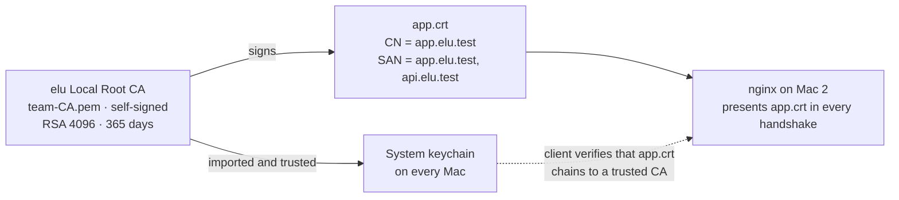
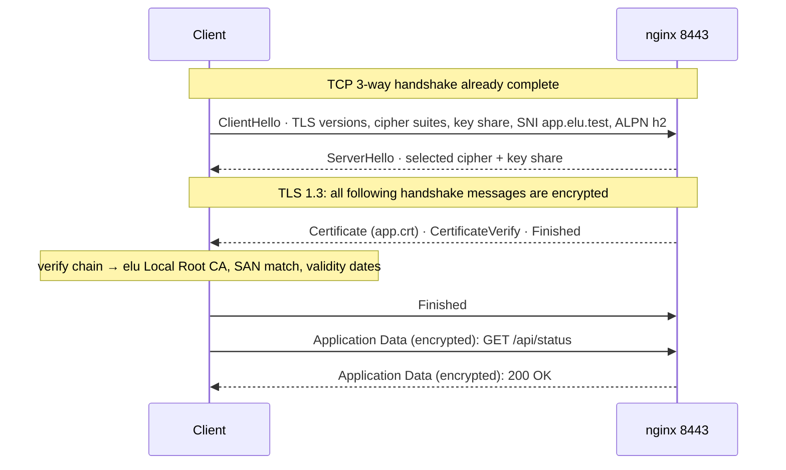
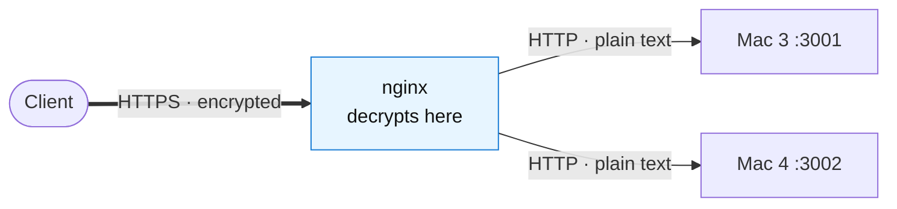

<div align="center">

# 06 · HTTPS & TLS at the Edge (Mac 2)

**A team Certificate Authority, a trusted server certificate, and TLS terminated at nginx.**

[← Load balancer](05-load-balancer.md) · **TLS** · [Caching →](07-caching.md)

</div>

> [!NOTE]
> **Summary:** Mac 2 created a team CA (Certificate Authority) and used it to sign a certificate for `app.elu.test`. Every Mac trusts the CA, so browsers and `curl` accept the HTTPS connection without warnings and without `-k`. nginx decrypts the traffic and forwards plain HTTP to the backends.

## Chain of Trust



| The client checks | Satisfied because |
| :-- | :-- |
| Issued by a trusted CA | `app.crt` is signed by `elu Local Root CA`, which is in every Mac's System keychain |
| Hostname matches | `app.elu.test` is listed in the certificate's SAN (Subject Alternative Name) |
| Within its validity period | Issued for 365 days |

## Certificate Creation

Commands run on Mac 2 in `~/team-certs`. Private keys never leave Mac 2 and are not part of this repository.

```bash
openssl genrsa -out team-CA.key 4096                                    # 1. CA private key
openssl req -x509 -new -nodes -key team-CA.key -sha256 -days 365 \
  -out team-CA.pem -subj "/CN=elu Local Root CA"                        # 2. self-signed CA certificate
openssl genrsa -out app.key 2048                                        # 3. server private key
openssl req -new -key app.key -out app.csr -subj "/CN=app.elu.test"     # 4. certificate signing request
openssl x509 -req -in app.csr -CA team-CA.pem -CAkey team-CA.key \
  -CAcreateserial -out app.crt -days 365 -sha256 -extfile app.ext       # 5. CA signs the server certificate
openssl verify -CAfile team-CA.pem app.crt                              # 6. → app.crt: OK
```

`app.ext` contains:

```ini
basicConstraints = CA:FALSE
keyUsage = digitalSignature, keyEncipherment
extendedKeyUsage = serverAuth
subjectAltName = DNS:app.elu.test, DNS:api.elu.test
```

<details>
<summary><b>Step and option reference</b></summary>

| Step / option | Meaning |
| :-- | :-- |
| `genrsa … 4096` | Generates an RSA private key. Whoever holds the CA key can sign certificates that every client trusts |
| `req -x509 -new` | Outputs a finished self-signed certificate directly (issuer = subject), which is what a root CA is |
| `-nodes` | The key file is not encrypted with a passphrase |
| `-sha256 -days 365` | Signature hash algorithm and validity period |
| `req -new … -out app.csr` | CSR: states that this public key belongs to `app.elu.test`, signed with `app.key` to prove possession |
| `basicConstraints = CA:FALSE` | The server certificate cannot sign other certificates |
| `keyUsage`, `extendedKeyUsage = serverAuth` | The key may only be used by a TLS server |
| `subjectAltName` | The hostnames the certificate is valid for; browsers match against SAN, not CN |
| `x509 -req -CA … -CAkey …` | The CA turns the CSR into a certificate signed with its private key |
| `-CAcreateserial` | Creates `team-CA.srl`; each certificate issued by a CA needs a unique serial number |
| `verify -CAfile` | Confirms the signature chain before nginx uses the certificate |

</details>

| File | Contents | Location |
| :-- | :-- | :-- |
| `team-CA.key` | CA private key | Mac 2 only, never shared |
| `team-CA.pem` | CA public certificate | Distributed to every Mac and trusted in the System keychain |
| `app.key` | Server private key | nginx only (`chmod 600`) |
| `app.crt` | Server certificate | nginx; sent to every client during the handshake |

Trusting the CA on each client:

```bash
sudo security add-trusted-cert -d -r trustRoot \
  -k /Library/Keychains/System.keychain team-CA.pem
```

## nginx TLS Configuration

```nginx
server {
    listen 8443 ssl;
    http2 on;
    server_name app.elu.test api.elu.test;
    ssl_certificate     /opt/homebrew/etc/nginx/certs/app.crt;
    ssl_certificate_key /opt/homebrew/etc/nginx/certs/app.key;
    ssl_protocols TLSv1.2 TLSv1.3;
    # location / { proxy_pass … }   see 05 · Load balancer
}

server {                                  # plain HTTP only redirects
    listen 8080 default_server;
    server_name app.elu.test api.elu.test;
    return 301 https://$host:8443$request_uri;
}
```

| Directive | Effect |
| :-- | :-- |
| `listen 8443 ssl` | TLS on this port: the handshake completes before any HTTP is exchanged |
| `http2 on` | Enables HTTP/2, negotiated inside the handshake through ALPN (Application-Layer Protocol Negotiation) |
| `ssl_certificate` / `ssl_certificate_key` | The certificate sent to clients and the private key that proves ownership |
| `ssl_protocols TLSv1.2 TLSv1.3` | Older, insecure protocol versions are refused |
| `return 301 …` | The HTTP port permanently redirects to HTTPS |

## Handshake



> [!WARNING]
> In TLS 1.3 the Certificate message is encrypted and cannot be inspected in Wireshark. For the packet evidence, TLS 1.2 was forced (`curl --tlsv1.2 --tls-max 1.2`), in which the Certificate, Server/Client Key Exchange and ChangeCipherSpec messages are visible. See [08 · Packet capture](08-packet-capture.md).

## TLS Termination



TLS ends at nginx. Keys and certificates are held in one place and the backends remain simple. The packet capture shows the same request encrypted on port 8443 and readable on port 3001.

## Verification

```bash
/usr/bin/curl -sv -o /dev/null https://app.elu.test:8443/api/status 2>&1 \
  | grep -E "SSL connection|ALPN: server|subject:|subjectAltName|issuer:|^< HTTP"
/usr/bin/curl -sI --http1.1 https://app.elu.test:8443/ | head -1
/usr/bin/curl -sI --http2   https://app.elu.test:8443/ | head -1
/usr/bin/curl -sI http://app.elu.test:8080/ | grep -iE "^HTTP|^location"
```

<details>
<summary><b>Output</b></summary>

```text
* SSL connection using TLSv1.3 / AEAD-AES256-GCM-SHA384
* ALPN: server accepted h2
*  subject: CN=app.elu.test
*  subjectAltName: host "app.elu.test" matched cert's "app.elu.test"
*  issuer: CN=elu Local Root CA
< HTTP/2 200
HTTP/1.1 200 OK
HTTP/2 200
HTTP/1.1 301 Moved Permanently
Location: https://app.elu.test:8443/
```

Cipher names and line order can differ slightly between curl versions.

</details>

> [!CAUTION]
> `curl -k` is never used: it disables certificate validation, so a successful response would prove nothing about TLS. `/usr/bin/curl` (the macOS build) is used because it reads the System keychain where the CA is trusted; a Homebrew curl uses a separate certificate store and would reject the CA.

---

<div align="center">

[← Load balancer](05-load-balancer.md) · [Caching →](07-caching.md)

</div>
