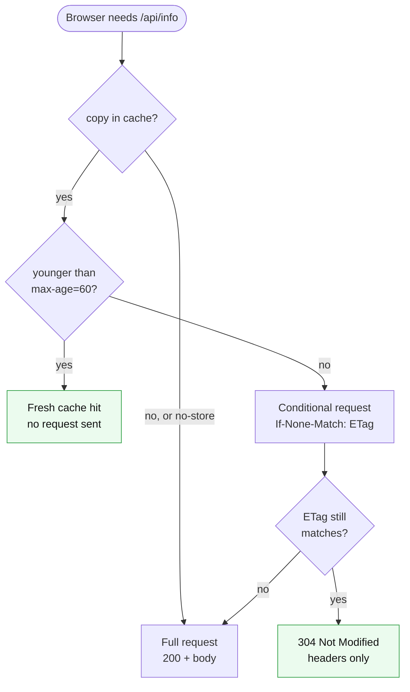

<div align="center">

# 07 · HTTP Caching

**Fresh cache hit, conditional request with 304, and full request with 200.**

[← TLS](06-tls.md) · **Caching** · [Packet capture →](08-packet-capture.md)

</div>

> [!NOTE]
> **Summary:** `/api/info` allows clients to cache it for 60 seconds and identifies its content with an ETag. Within 60 seconds the browser sends no request; after that it asks whether its copy is still current and receives a headers-only `304`. `/api/status` is marked `no-store` and is always fetched in full.

## Decision Flow



| Case | Request on the network | Server work | Result |
| :-- | :-- | :-- | :-- |
| **Fresh cache hit** (within `max-age`) | None | None | Served from the browser cache |
| **Conditional request** (stale copy with ETag) | Yes, with `If-None-Match` | ETag comparison only | `304`, no body |
| **Full request** (nothing cached, or `no-store`) | Yes | Full response built | `200` + body |

## Headers per Endpoint

| Endpoint | `Cache-Control` | `ETag` | Behaviour |
| :-- | :-- | :-: | :-- |
| `/api/info` | `public, max-age=60` | Yes | Cacheable for 60 s, then revalidated with `304` |
| `/api/status` | `no-store` | No | Dynamic (timestamp and backend ID); never cached, always `200` |

> [!IMPORTANT]
> `/api/info` is byte-identical on Mac 3 and Mac 4, so both backends compute the same SHA-1 ETag. A revalidation request handled by either backend therefore still returns `304`. If the ETags differed, every other revalidation would return a full `200`.

## Verification

```bash
/usr/bin/curl -sI https://app.elu.test:8443/api/info | grep -iE "^HTTP|^cache-control|^etag"
ETAG=$(/usr/bin/curl -sI https://app.elu.test:8443/api/info | grep -i '^etag' | awk '{print $2}' | tr -d '\r')
/usr/bin/curl -sI -H "If-None-Match: $ETAG" https://app.elu.test:8443/api/info | head -1
/usr/bin/curl -sI https://app.elu.test:8443/api/status | grep -iE "^HTTP|^cache-control"
```

<details>
<summary><b>Output</b></summary>

```text
HTTP/2 200
cache-control: public, max-age=60
etag: "6402143662621d1b"
HTTP/2 304
HTTP/2 200
cache-control: no-store
```

</details>

<details>
<summary><b>Browser developer tools</b> (shows the fresh cache hit)</summary>

1. Open `https://app.elu.test:8443/api/info` in Chrome or Safari with the **Network** panel open and "Disable cache" unchecked.
2. Load the URL again within 60 s: the Size column shows **(memory cache)** or **(disk cache)**; no request is sent.
3. Reload: the browser sends `If-None-Match` and receives **304**.
4. Repeat with `/api/status`: always a full **200** because of `no-store`.

</details>

---

<div align="center">

[← TLS](06-tls.md) · [Packet capture →](08-packet-capture.md)

</div>
