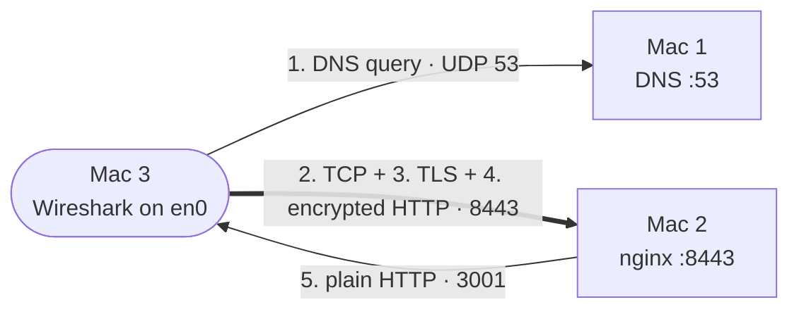

# 08 · Packet Capture (Mac 3)

**One request on the wire: DNS → TCP → TLS → encrypted HTTP → plain HTTP to the backend.**

[← Caching](07-caching.md) · **Packet capture** · [Failure demonstrations →](09-failure-demos.md)

> [!NOTE]
> **Summary:** Mac 3 recorded its Wi-Fi traffic in Wireshark while requesting `https://app.elu.test:8443/api/status`. The capture contains the DNS query to Mac 1, the TCP and TLS handshakes with Mac 2, the encrypted request, and nginx's plain-HTTP request to Backend A on Mac 3.

## Capture Point

Mac 3 is both a client and Backend A, so every stage of the request crosses its Wi-Fi interface:

> [!WARNING]
> A Wi-Fi station only receives frames addressed to it, so the nginx → Backend B hop (Mac 2 → Mac 4) is not visible from Mac 3. The request was therefore sent twice during the capture, so that round robin forwarded one of the two requests to Backend A.

## Procedure

| # | Action | Reason |
| :-: | :-- | :-- |
| 1 | `sudo dscacheutil -flushcache; sudo killall -HUP mDNSResponder` | Without a flush, the cached answer is used and no DNS packet is sent |
| 2 | Wireshark → **Wi-Fi: en0** → capture filter `port 53 or port 8443 or port 3001 or port 3002` → start | Records only the project's traffic |
| 3 | Run twice: `/usr/bin/curl -v --tlsv1.2 --tls-max 1.2 https://app.elu.test:8443/api/status` | TLS 1.2 keeps the Certificate message unencrypted |
| 4 | Stop → save as `phase1-full-flow-tls12.pcapng` | Evidence file |

> [!NOTE]
> Wireshark only recognises TLS automatically on port 443. Packets on 8443 were decoded with **Decode As… → TLS**, and packets on 3001 with **Decode As… → HTTP**.

## Analysis

| Layer / event | Display filter | Observation |
| :-- | :-- | :-- |
| **DNS** | `dns.qry.name contains "elu"` | Query from an ephemeral port to Mac 1 on **53/UDP**; the response contains Mac 2's IP |
| **TCP handshake** | `tcp.port == 8443 && tcp.flags.syn == 1` | **SYN → SYN-ACK**, followed by ACK: Mac 3 ephemeral port → Mac 2 **8443** |
| **TLS handshake** | `tls.handshake` | ClientHello (SNI `app.elu.test`) · ServerHello · **Certificate** (issuer `elu Local Root CA`) · Server/Client Key Exchange · **ChangeCipherSpec** |
| **Encrypted data** | `tls.record.content_type == 23` | "Application Data" records: the HTTP request is not readable |
| **TLS termination** | `tcp.port == 3001` | **Readable** `GET /api/status` and `X-Backend: A` between Mac 2 and Mac 3 (Follow → TCP Stream) |
| **Sequence / acknowledgement** | any TCP packet, expanded | Relative sequence and acknowledgement numbers; the ACK is the next byte expected |
| **Overview** | Statistics → **Flow Graph** | The complete exchange in one view |

## Ports and Sockets

| Hop | Source | Destination | Transport |
| :-- | :-- | :-- | :-- |
| DNS | Mac 3 : ephemeral | Mac 1 : **53** | UDP |
| HTTPS | Mac 3 : ephemeral | Mac 2 : **8443** | TCP |
| Backend request | Mac 2 : ephemeral | Mac 3 : **3001** | TCP |

A socket is an IP address plus a port; a TCP connection is identified by the 4-tuple (source IP, source port, destination IP, destination port). The client uses an ephemeral port, a temporary high-numbered port chosen by the operating system for each connection, while the server listens on a fixed, known port.

<b>TCP reliability</b>

| Concept | Visible in the capture as |
| :-- | :-- |
| Handshake synchronises sequence numbers | SYN carries the client's initial sequence number, SYN-ACK the server's |
| Sequence number | Byte offset of the segment's first byte (shown relative, starting at 0) |
| Acknowledgement number | The next byte the receiver expects: all earlier bytes have arrived |
| Retransmission | A segment that is not acknowledged in time is sent again |
| Flow control | The `Window` field: how many bytes the receiver can currently accept |

<b>TLS 1.2 compared with TLS 1.3</b>

| | TLS 1.2 (`--tls-max 1.2`) | TLS 1.3 (default) |
| :-- | :-- | :-- |
| Handshake round trips | 2 | 1 |
| Certificate visible | Yes | No (encrypted) |
| Identifiable handshake messages | ClientHello, ServerHello, Certificate, ServerKeyExchange, ClientKeyExchange, ChangeCipherSpec | ClientHello, ServerHello, then encrypted records |

> [!IMPORTANT]
> The same request appears twice in the capture: as unreadable Application Data on port 8443 (client → nginx) and as readable HTTP on port 3001 (nginx → Backend A). This shows that TLS terminates at the edge.

Screenshots and `.pcapng` files: [`evidence/G-packet-capture/`](../evidence/G-packet-capture/)

---

[← Caching](07-caching.md) · [Failure demonstrations →](09-failure-demos.md)

