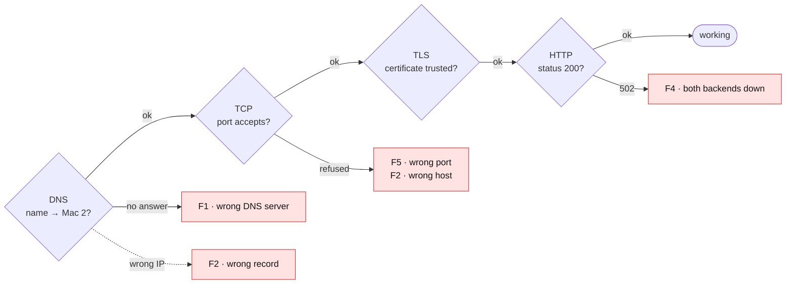

<div align="center">

# 09 · Failure Demonstrations

**Each fault is introduced deliberately, observed, and attributed to the layer that failed.**

[← Packet capture](08-packet-capture.md) · **Failure demonstrations** · [README →](../README.md)

</div>

> [!NOTE]
> **Summary:** the system was broken in the five ways required by the brief, plus one additional whole-machine failure. Each fault was diagnosed layer by layer (DNS → TCP → TLS → HTTP) to identify which layer failed and to show that the other layers were unaffected.

## Diagnostic Method

Layers are checked in order; the first failing check identifies the faulty layer.

| Step | Layer | Command | Healthy result |
| :-: | :-- | :-- | :-- |
| 1 | DNS | `dig +short app.elu.test` | Mac 2's IP |
| 2 | TCP | `nc -vz <Mac 2 IP> 8443` | `succeeded` |
| 3 | TLS | `/usr/bin/curl -v https://app.elu.test:8443/` | certificate verified, TLS 1.3 |
| 4 | HTTP | `/usr/bin/curl -si https://app.elu.test:8443/api/status \| head -1` | `HTTP/2 200` |



## Overview

| # | Fault | Introduced on | Observation | Failed layer | Demonstrates |
| :-: | :-- | :-: | :-- | :-- | :-- |
| **F1** | Client uses the wrong DNS server | client | Name lookup fails; ping to Mac 2 succeeds | **DNS** | DNS and IP connectivity are independent |
| **F2** | DNS record points to the wrong IP | Mac 1 | Lookup succeeds; connection fails | DNS answer → **TCP** | DNS is a directory, not a connection |
| **F3** | One backend stopped | Mac 3 | Every request returns `200`, all from Backend B | none (masked by the edge) | Load balancer failover |
| **F4** | Both backends stopped | Mac 3 + 4 | DNS, TCP and TLS succeed; nginx returns `502 Bad Gateway` | **upstream** of the edge | Where the edge ends and the backend begins |
| **F5** | Wrong destination port | client | Host reachable; port refuses the connection | **Transport** | IP identifies the host, the port identifies the service |
| F3b | Whole backend machine offline (additional) | Mac 4 | All requests `200` from A; one request delayed ~2 s | none (masked by the edge) | Machine-level failover |

---

### F1 · Wrong DNS Server on a Client

<details>
<summary><b>Commands and output</b></summary>

```bash
# Fault (on a client)
sudo networksetup -setdnsservers Wi-Fi <college DNS>
sudo dscacheutil -flushcache; sudo killall -HUP mDNSResponder

# Observation
dig app.elu.test | grep status
ping -c 2 <Mac 2 IP>

# Restore
sudo networksetup -setdnsservers Wi-Fi <Mac 1 IP>
sudo dscacheutil -flushcache; sudo killall -HUP mDNSResponder
```

```text
;; ->>HEADER<<- opcode: QUERY, status: NXDOMAIN, id: …
2 packets transmitted, 2 packets received, 0.0% packet loss
```

</details>

**Explanation:** the college DNS server has no records for `elu.test` and returns `NXDOMAIN`. Packets still reach Mac 2 by IP address; only name resolution is broken.

### F2 · DNS Record Points to the Wrong IP

<details>
<summary><b>Commands and output</b></summary>

```bash
# Fault (Mac 1): app.elu.test now points to Mac 3 instead of Mac 2
DNSMASQ_CONF="$(brew --prefix)/etc/dnsmasq.conf"
sed -i '' "s/^host-record=app.elu.test,.*/host-record=app.elu.test,<Mac 3 IP>/" "$DNSMASQ_CONF"
sudo brew services restart dnsmasq

# Observation (client, after flushing its DNS cache)
dig +short app.elu.test
/usr/bin/curl -sS https://app.elu.test:8443/api/status

# Restore (Mac 1)
sed -i '' "s/^host-record=app.elu.test,.*/host-record=app.elu.test,<Mac 2 IP>/" "$DNSMASQ_CONF"
sudo brew services restart dnsmasq
```

```text
<Mac 3 IP>
curl: (7) Failed to connect to app.elu.test port 8443 …: Couldn't connect to server
```

</details>

**Explanation:** DNS returns an address without checking whether the service exists there. The client then connects to port 8443 on Mac 3, where nothing is listening, so the failure appears at the TCP layer.

### F3 · One Backend Stopped

<details>
<summary><b>Commands and output</b></summary>

```bash
# Fault: stop Backend A on Mac 3 (Ctrl+C)

# Observation (any client)
for i in 1 2 3 4 5 6; do
  /usr/bin/curl -s -D - -o /dev/null https://app.elu.test:8443/api/status | grep -iE "^HTTP|^x-backend"
done

# Restore (Mac 3); after ~10 s requests alternate A, B again
python3 backend/server.py A 3001
```

```text
HTTP/2 200
x-backend: B
HTTP/2 200
x-backend: B
…
```

</details>

**Explanation:** Mac 3 answers nginx's SYN with an RST (connection refused) immediately. `proxy_next_upstream` retries the same request on Backend B, and `max_fails=1 fail_timeout=10s` excludes A for 10 seconds.

### F4 · Both Backends Stopped

<details>
<summary><b>Commands and output</b></summary>

```bash
# Fault: stop Backend A (Mac 3) and Backend B (Mac 4)

# Observation (any client)
dig +short app.elu.test
nc -vz <Mac 2 IP> 8443
/usr/bin/curl -si https://app.elu.test:8443/api/status | head -1

# Restore
python3 backend/server.py A 3001        # Mac 3
python3 backend/server.py B 3002        # Mac 4
```

```text
<Mac 2 IP>
Connection to <Mac 2 IP> port 8443 [tcp/*] succeeded!
HTTP/2 502
```

</details>

**Explanation:** DNS, TCP and the TLS handshake with nginx all succeed, so the edge is healthy. nginx has no backend to forward to and returns `502 Bad Gateway`: the proxy received no valid response from the upstream server.

### F5 · Wrong Destination Port

<details>
<summary><b>Commands and output</b></summary>

```bash
/usr/bin/curl -sS https://app.elu.test:9443/
nc -vz <Mac 2 IP> 8443
nc -vz <Mac 2 IP> 9443
```

```text
curl: (7) Failed to connect to app.elu.test port 9443 …: Couldn't connect to server
Connection to <Mac 2 IP> port 8443 [tcp/*] succeeded!
nc: connectx to <Mac 2 IP> port 9443 (tcp) failed: Connection refused
```

</details>

**Explanation:** the IP address selects the host and the port selects the service. Mac 2 is reachable, but no process listens on 9443, so the SYN is answered with an RST.

### F3b · Whole Backend Machine Offline (Additional)

<details>
<summary><b>Commands and output</b></summary>

```bash
# Fault: Mac 4 disconnects from Wi-Fi

# Observation (any client): same loop as F3 → all responses from Backend A,
# the first one delayed by up to 2 s

# Restore: Mac 4 reconnects (same IP); Backend B rejoins within ~10 s
```

</details>

**Explanation:** an offline machine sends no reply at all, not even an RST, so nginx waits for `proxy_connect_timeout 2s` before retrying on Backend A. A *refused* connection means the host is up but the port is closed; a *timeout* means nothing answered.

---

<div align="center">

[← Packet capture](08-packet-capture.md) · [README →](../README.md)

</div>
